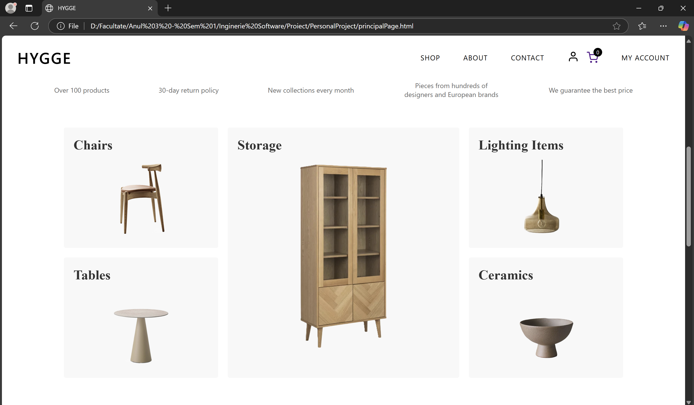

# 🏠 E-commerce Web Application for Interior Design Items

📌 Obs: This application does not contain an actual backend; it is a project focused on CSS and JavaScript. All data is stored and managed using local storage functionality 👎. Backend implementation is currently in process for future versions.

## Project Overview
This project involves developing an e-commerce web application dedicated to interior design products, designed to enhance the online shopping experience for both users and sellers. The application offers features such as a product catalog, shopping cart, and various payment methods to ensure a complete and efficient e-commerce experience.

This interior design application is intended to help users visualize and plan interior spaces, whether private homes, offices, or commercial spaces. Users can experiment with different design styles using a catalog of interior design products (specifically, furniture items).

The application is similar to furniture and decor-oriented e-commerce platforms such as Wayfair, IKEA, or Houzz. Like these, the application will include a well-structured product catalog.

**Author:** Maria-Magdalena Creț  
**Institution:** Technical University of Cluj-Napoca  
**Faculty:** Faculty of Automation and Computer Science  
**Academic Year:** 2024-2025

## Theoretical Foundations
The project uses Web 2.0 concepts that allow users to create and share content and facilitate public access to databases through APIs, making it well-suited for e-commerce web applications.
Basic design patterns: MVC (Model-View-Controller) for separating business logic from the graphical interface.

## 🛠️ Technologies Used

### Backend (in process)
- **Java and Spring:** 
  - Robust and scalable infrastructure
  - Support for creating RESTful services
  - Efficient request handling

### Frontend
- **CSS & HTML:** 
  - Responsive designs with media queries
  - Dynamic effects and transitions
  - Flexible layouts with Flexbox and Grid

### Database (in process)
- **MySQL:** 
  - User data storage
  - Management of design projects, user preferences, order history, and available products

## 📱 Application Features

- User authentication (login/register)
- Product catalog with categories
- Advanced product filtering
- Shopping cart functionality
- Checkout process with multiple payment options
- Order tracking
- User profile management
- Admin panel for product management
- Responsive design for all devices

## 🖼️ Presentation

  

    
    
  

  

    
    
  

  

    
  

## 🔄 Application Architecture (in process)

The application follows a multi-tier architecture:
- **Presentation Layer:** User interface components
- **Business Logic Layer:** Services and controllers
- **Data Access Layer:** Database interactions
- **Database Layer:** MySQL database

## 🚀 Setup & Installation

### Requirements
- Java JDK 17+
- Maven
- MySQL Database
- Web browser (Chrome, Firefox, Edge, etc.)

### Installation Steps
1. Clone the repository
2. Configure the database connection in `application.properties`
3. Run `mvn clean install` to build the project
4. Run the application using `java -jar target/ecommerce-app.jar`
5. Access the application at `http://localhost:8080`

## 👨‍💻 Development

The project is structured using the MVC pattern:
- **Models:** Data structures and entity definitions
- **Views:** Frontend templates and UI components
- **Controllers:** Request handling and business logic implementation

## 🧪 Testing and Validation

The application includes various testing approaches:
- Manual testing for UI/UX interactions
- Automated testing for repetitive processes
- Exploratory testing for unexpected issues
- Static code analysis
- Dynamic testing of real-time functionality
- Acceptance testing from the user's perspective

## 📋 License
This project is provided for educational purposes.
